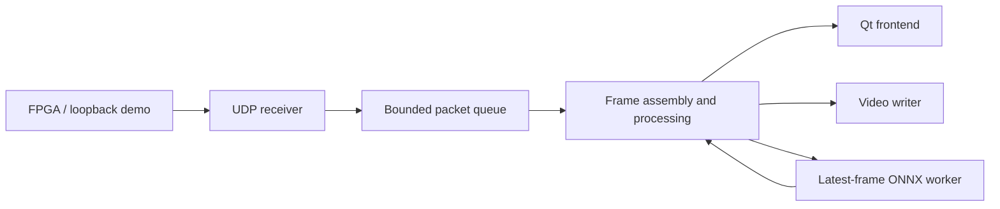

<div align="center">

# UDP Vision Console

**FPGA image streams, reconstructed and inspected on the desktop.**

**English** · [简体中文](README.zh-CN.md)

[](https://github.com/Sanssssssssssssssss/UDP-High-Speed-Image-Receiver-Display-System/actions/workflows/ci.yml)
[](LICENSE)


[Quick start](#quick-start) · [Build](docs/BUILDING.md) · [Architecture](docs/ARCHITECTURE.md) · [Protocol](docs/PROTOCOL.md) · [Contribute](CONTRIBUTING.md)

</div>

A Qt/C++ desktop application for receiving RGB565 image streams over UDP,
reconstructing frames, adjusting images, saving snapshots and recording video.
Optional ONNX detection runs on a separate worker. A built-in loopback sender
exercises the complete receive/display path without an FPGA.

> **Active version: `Post-Train`.** This branch contains the current pipeline,
> desktop controls and inference integration. `main` is a historical implementation.


*Captured from the Windows application on 2026-09-30 using the existing reference
image over loopback UDP. Counters are a momentary demo observation, not a hardware benchmark.*

## What works today

| Area | Implementation |
| --- | --- |
| Reception | Configurable UDP endpoint; batch delivery; bounded packet queue and resynchronization after queue drops |
| Reconstruction | 400 × 400 RGB565, big-endian pixels; 4 transport bytes + up to 800 payload bytes per row |
| Desktop | Live display, FPS/parser/queue statistics, brightness, gamma, sharpness, denoise and flips |
| Capture | PNG snapshots; AVI/MJPEG and MP4/mp4v recording through OpenCV, subject to codec availability |
| Inference | Single-class ONNX detection; OpenCV DNN with Python ONNX Runtime fallback; latest-frame mailbox |
| Diagnostics | Optional Windows Npcap reception and opt-in tshark capture |
| FT601 USB | UI, runtime detection and packetizer scaffold; **device open/read loop is not implemented** |

The demo targets 60 frames/s × 402 datagrams = **24,120 datagrams/s**, with 804
bytes per demo datagram. Actual throughput depends on the machine and network.
The old 1,300-byte / 800 × 800 README claims do not describe this branch's parser.
Rows have no trusted sequence number: missing or reordered UDP data cannot be
reconstructed exactly. See [protocol and loss behavior](docs/PROTOCOL.md).

## Quick start

### Windows portable package

Open the latest successful **Post-Train** run in
[Actions](https://github.com/Sanssssssssssssssss/UDP-High-Speed-Image-Receiver-Display-System/actions/workflows/ci.yml),
download `windows-portable-and-test`, then extract the inner
`udp-vision-windows-x64.zip`. Keep the directories together and run:

```powershell
.\udp-vision.exe --demo
```

The package includes Qt plugins, OpenCV/compiler DLLs, the existing ONNX model,
reference image and a private Python CPU inference runtime. No global Python is
required. Npcap, Wireshark and FTDI drivers are optional external installations.
Builds are unsigned. GitHub may require sign-in to download CI artifacts.

### Build from source

```bash
git clone --branch Post-Train https://github.com/Sanssssssssssssssss/UDP-High-Speed-Image-Receiver-Display-System.git
cd UDP-High-Speed-Image-Receiver-Display-System
cmake -S . -B build -DCMAKE_BUILD_TYPE=Release
cmake --build build --parallel 2
ctest --test-dir build --output-on-failure
```

Install **CMake ≥ 3.21, a C++14 compiler, Qt 5.14+ and OpenCV 3.4.8+** first.
Qt and OpenCV must match the compiler/architecture. Windows/MSYS2, existing
MinGW toolchains, Linux, AI setup and packaging are covered in
[the build guide](docs/BUILDING.md). Current SIMD code targets x86/x64.

For hardware, launch without `--demo`, select **Network → UDP Socket**, enter the
local bind address and destination port (default `0.0.0.0:8080`), then apply.
The demo sends to `127.0.0.1:8080`; keep the receive settings compatible.

## Code map

```text
src/
  app/                  Entry point, window assembly and local demo sender
  frontend/             Qt control panel and frame presentation widget
  backend/
    network/            UDP/Npcap receiver and FT601 scaffold
    processing/         Frame assembly, tuning, snapshots and recording
    inference/          ONNX worker and Python process protocol
tests/                  Native pipeline and real-model helper tests
scripts/                Windows packaging and existing benchmark tools
cmake/                  Runtime dependency collection
models/                 Existing best.onnx model
assets/                 Existing demo reference image
docs/                   Build, architecture, protocol, images and reports
  history/              Previous planning and optimization records
legacy/                 Inactive historical Qt UI/project files
.github/                CI, dependency updates and contribution templates
```

Headers live beside implementations. The frontend and backend are modules in
one desktop process. Start at [`ApplicationLauncher.cpp`](src/app/ApplicationLauncher.cpp),
then follow [`UdpFramePipelineWorker.cpp`](src/backend/processing/UdpFramePipelineWorker.cpp).



## Verification and delivery

Actions builds on **Windows x64 and Ubuntu 22.04** and tests UDP loopback, RGB565
decoding, short-frame recovery, queue resynchronization, PNG round-trip, AVI decoding
and the desktop demo. Python checks run the real ONNX model over consecutive binary
requests. Windows packaging repeats the demo and inference with a clean runtime
search path before producing a ZIP and SHA-256 manifest. Linux ZIPs require system Qt/OpenCV.

Real FPGA link stability, sustained hardware throughput and FT601 transfers are
outside automated coverage. Earlier measurements remain in
[`docs/reports`](docs/reports), with their original environment and dates.

## Hardware and original images

See the related [FPGA acquisition project](https://github.com/Sanssssssssssssssss/endoscopic-image-acquisition-system)
for the embedded side. Original repository illustrations are retained:

<details>
<summary>Original hardware data flow and earlier UI</summary>


</details>

## License

Project code is [MIT](LICENSE). Dependencies retain their licenses; model/image
provenance is documented separately in [third-party notices](THIRD_PARTY_NOTICES.md).
