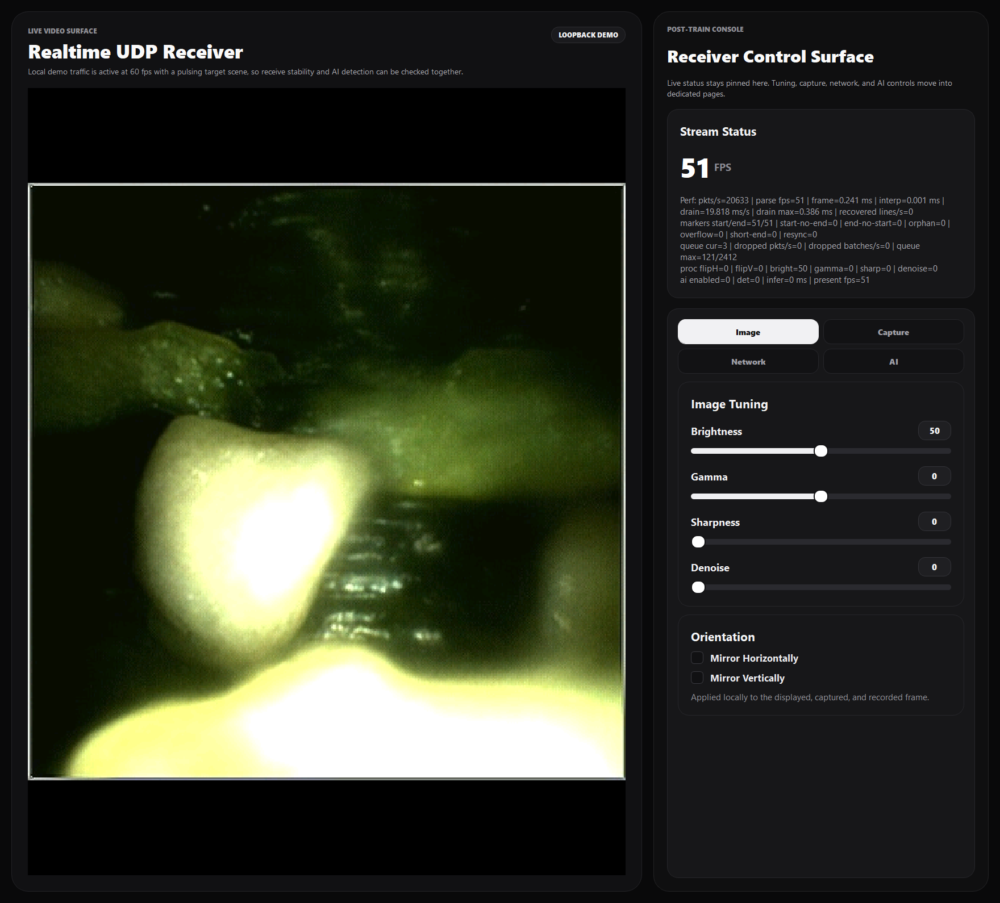
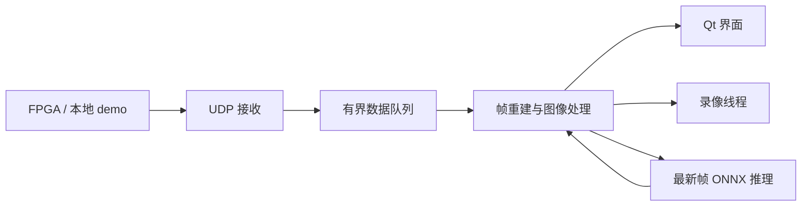

<div align="center">

# UDP Vision Console

**面向 FPGA 图像流的桌面接收、重建与观察工具。**

[English](README.md) · **简体中文**

[](https://github.com/Sanssssssssssssssss/UDP-High-Speed-Image-Receiver-Display-System/actions/workflows/ci.yml)
[](LICENSE)


[开始使用](#快速开始) · [构建说明](docs/BUILDING.md) · [架构](docs/ARCHITECTURE.md) · [协议](docs/PROTOCOL.md) · [参与开发](CONTRIBUTING.md)

</div>

基于 Qt/C++ 的桌面应用，通过 UDP 接收 RGB565 图像流，完成帧重建、图像调节、截图和录像。
可选的 ONNX 检测在独立线程运行。内置本地 UDP 发送器，没有 FPGA 也能运行完整接收与显示流程。

> **当前开发版本：`main`。** 最新处理流水线、控制界面、推理功能及仓库整理结果
> 已从 `Post-Train` 合并到主分支。



*2026-09-30 从实际 Windows 程序截取，输入为仓库原有参考图片，经本地 UDP 回环发送。
计数是截图时的瞬时观测，不代表硬件吞吐基准。*

## 当前功能

| 模块 | 已实现内容 |
| --- | --- |
| 接收 | 可配置 UDP 地址和端口；批量交付、有界队列、队列丢包后重新同步 |
| 重建 | 400 × 400 RGB565，大端像素；每行 4 字节传输头 + 最多 800 字节像素数据 |
| 界面 | 实时图像、FPS、解析与队列统计；亮度、Gamma、锐化、降噪和翻转 |
| 保存 | PNG 截图；OpenCV AVI/MJPEG、MP4/mp4v 录像，取决于运行库编码器支持 |
| 推理 | 单类别 ONNX 检测；OpenCV DNN 与 Python ONNX Runtime 回退；最新帧邮箱 |
| 诊断 | 可选的 Windows Npcap 接收及手动启用的 tshark 抓包 |
| FT601 USB | 界面、运行库检测和组包预留；**尚未实现设备打开和 D3XX 读取循环** |

内置 demo 发送目标是 60 帧/秒 × 每帧 402 包，即 **24,120 包/秒**，每包 804 字节。
实际速率取决于设备与负载。旧 README 的 1,300 字节包长与 800 × 800 分辨率不对应当前解析器。
行数据没有可信序号，不能精确恢复中间丢包或乱序；详见[协议与丢包处理](docs/PROTOCOL.md)。

## 快速开始

### Windows 便携包

进入 [Actions](https://github.com/Sanssssssssssssssss/UDP-High-Speed-Image-Receiver-Display-System/actions/workflows/ci.yml)，
选择最新成功的 **main** 工作流，下载 `windows-portable-and-test`，
再解压其中的 `udp-vision-windows-x64.zip`。保留完整目录结构，运行：

```powershell
.\udp-vision.exe --demo
```

软件包包含 Qt 插件、OpenCV 和编译器 DLL、原有模型与参考图片，以及独立的 Python CPU
推理环境，无需全局安装 Python。Npcap、Wireshark 和 FTDI 驱动按需单独安装。
当前构建未签名；下载 GitHub CI 附件可能需要登录。

### 从源码构建

```bash
git clone --branch main https://github.com/Sanssssssssssssssss/UDP-High-Speed-Image-Receiver-Display-System.git
cd UDP-High-Speed-Image-Receiver-Display-System
cmake -S . -B build -DCMAKE_BUILD_TYPE=Release
cmake --build build --parallel 2
ctest --test-dir build --output-on-failure
```

先安装 **CMake ≥ 3.21、C++14 编译器、Qt 5.14+ 和 OpenCV 3.4.8+**，Qt 与 OpenCV
必须匹配编译器和架构。Windows/MSYS2、已有 MinGW 环境、Linux 依赖、AI 与打包步骤见
[构建指南](docs/BUILDING.md)。当前 SIMD 实现面向 x86/x64。

连接硬件时不传 `--demo`，在 **Network → UDP Socket** 填写本地绑定地址和目标端口后应用，
默认 `0.0.0.0:8080`。本地 demo 发往 `127.0.0.1:8080`，使用时保持接收配置与之兼容。

## 代码在哪里

```text
src/
  app/                  程序入口、窗口组装、本地 demo 发送器
  frontend/             Qt 控制面板和图像显示控件
  backend/
    network/            UDP/Npcap 接收、FT601 预留
    processing/         帧重建、图像处理、截图和录像
    inference/          ONNX 工作线程与 Python 进程协议
tests/                  C++ 流水线与真实模型测试
scripts/                Windows 打包及原有基准工具
cmake/                  运行库依赖收集
models/                 原有 best.onnx 模型
assets/                 原有 demo 参考图片
docs/                   构建、架构、协议、截图和报告
  history/              历史规划与优化记录
legacy/                 未参与构建的旧 Qt 界面和工程文件
.github/                CI、依赖更新与协作模板
```

头文件与实现放在同一模块。前端和后端是同一桌面进程内的模块。
从 [`ApplicationLauncher.cpp`](src/app/ApplicationLauncher.cpp) 开始阅读，
再进入 [`UdpFramePipelineWorker.cpp`](src/backend/processing/UdpFramePipelineWorker.cpp)。



## 测试与交付

Actions 在 **Windows x64 与 Ubuntu 22.04** 构建，检查 UDP 回环、RGB565 解码、短帧补行、
队列溢出重同步、PNG 保存后读取、AVI 解码及桌面 demo。Python 测试调用真实模型连续处理
二进制请求。Windows 打包后清除开发环境路径，再次运行 demo 和推理，生成 ZIP 与 SHA-256
文件清单。Linux ZIP 需要系统已安装 Qt/OpenCV 运行库。

真实 FPGA 链路稳定性、持续硬件吞吐及 FT601 传输不在自动化覆盖范围内。
此前测量保留在 [`docs/reports`](docs/reports)，以原记录的环境与日期为准。

## 硬件及原有图片

嵌入式端见[配套 FPGA 采集项目](https://github.com/Sanssssssssssssssss/endoscopic-image-acquisition-system)。
原仓库架构图和旧界面图完整保留：

<details>
<summary>展开原硬件数据流与历史界面</summary>


</details>

## 许可

代码采用 [MIT](LICENSE)。依赖保留各自许可证；模型和图片来源单独列于
[第三方说明](THIRD_PARTY_NOTICES.md)。
